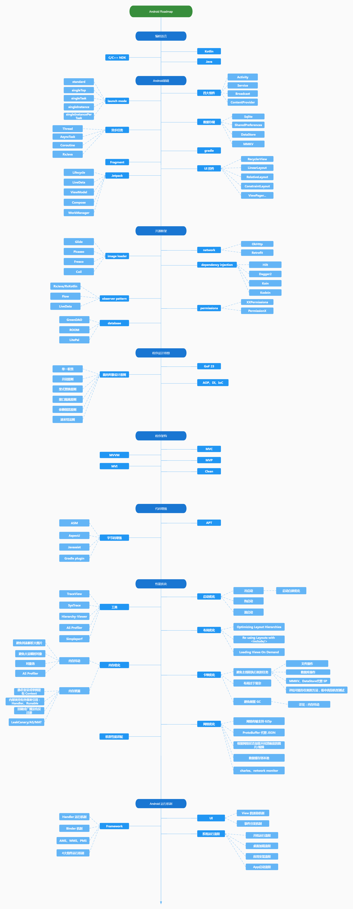

# 最全的 Android 技术栈

Android 程序员所需要的技能：「**数据结构算法**」「**程序架构**」「**设计模式**」「**性能优化**」「**组件化**」「**NDK技术**」「**自定义View**」「**性能优化**」「**Android源码分析**」「**深入理解Kotlin**」「**Java核心技术**」「**Jetpack**」「**Router**」「**Flutter**」「**RxJava**」「**Glide**」「**LeakCanary**」「**Dagger2**」「**Retrofit**」「**OkHttp**」「**ButterKnife**」「**GreenDAO**」「**经典书籍**」等。如果您有任何问题或建议欢迎 [**Issues**](https://github.com/chiclaim/AndroidAll/issues/new) 。 核心知识脉络：

## #Java核心技术#

为了能够开发高质量的 Android App，首先要求我们具备扎实的 Java 基础。

不仅需要熟练使用 Java 各项 API。如 Java 网络编程、多线程并发、集合框架等。

还需要掌握常见 API 的底层原理。如 集合框架的实现原理，要求我们掌握常用的数据结构与算法。

除此以外，还需要我们对 Java 执行机制有一定了解，这个时候可要求我们对 Java 虚拟机有一定的掌握。如 class 字节码、类加载器、垃圾回收机制等。

关于这方面的知识，可以学习参考我之前的一些总结：
 
**Java基础：**

- [Java 反射技术详解](https://blog.csdn.net/johnny901114/article/details/7538998)
- [Java XML 解析方式汇总](https://blog.csdn.net/johnny901114/article/details/7867934)
- [Java ClassLoader 类加载器详解](https://blog.csdn.net/johnny901114/article/details/7738958)

**Java网络编程：**

- [Java 网络编程详解（一）](https://blog.csdn.net/johnny901114/article/details/7866864)
- [Java 网络编程详解（二）](https://blog.csdn.net/johnny901114/article/details/7865617)

**JavaIO：**
- [Java I/O 流操作（一）System Properties Runtime 类](https://blog.csdn.net/johnny901114/article/details/8710381)
- [Java I/O 流操作（二）字节流与缓冲流](https://blog.csdn.net/johnny901114/article/details/8710403)
- [Java I/O 流操作（三）File 文件操作、PrintWriter、SequenceInputStream](https://blog.csdn.net/johnny901114/article/details/8710433)
- [Java I/O 流操作（四）对象的序列化](https://blog.csdn.net/johnny901114/article/details/8710341)

**Java多线程：**
- [Java 多线程（一）线程间的互斥和同步通信](https://blog.csdn.net/johnny901114/article/details/8695668)
- [Java 多线程（二）同步线程分组问题](https://blog.csdn.net/johnny901114/article/details/7854666)
- [Java 多线程（三）线程池入门 Callable 和 Future](https://blog.csdn.net/johnny901114/article/details/8695693)
- [Java 多线程（四）ThreadPoolExecutor 线程池各参数的意义](https://blog.csdn.net/johnny901114/article/details/8332088)
- [Java 多线程（五）Lock 和 Condition 实现线程同步通信](https://blog.csdn.net/johnny901114/article/details/8695708)
- [Java 多线程（六）Semaphore 实现信号灯](https://blog.csdn.net/johnny901114/article/details/8695717)
- [Java 多线程（七）CyclicBarrier 同步的工具类](https://blog.csdn.net/johnny901114/article/details/8695723)
- [Java 多线程（八）CountDownLatch 同步工具类](https://blog.csdn.net/johnny901114/article/details/8695726)
- [Java 多线程（九）Exchanger 同步工具类](https://blog.csdn.net/johnny901114/article/details/8696019)
- [Java 多线程（十）ArrayBlockingQueue 阻塞队列](https://blog.csdn.net/johnny901114/article/details/8696026)
- [Java 多线程（十一）JDK 同步集合](https://blog.csdn.net/johnny901114/article/details/8696032)

**Java集合框架：**
- [数据结构与算法（十四）深入理解红黑树和JDK TreeMap和TreeSet源码分析](https://chiclaim.blog.csdn.net/article/details/81046088)
- [数据结构与算法（十三）平衡二叉树之AVL树](https://chiclaim.blog.csdn.net/article/details/80740418)
- [数据结构与算法（十二）并查集(Union Find)及时间复杂度分析](https://chiclaim.blog.csdn.net/article/details/80721436)
- [数据结构与算法（十一）Trie字典树](https://chiclaim.blog.csdn.net/article/details/80711441)
- [数据结构与算法（十）线段树(Segment Tree)入门](https://chiclaim.blog.csdn.net/article/details/80643017)
- [数据结构与算法（九）Set集合和BinarySearchTree的时间复杂度分析](https://chiclaim.blog.csdn.net/article/details/80628876)
- [数据结构与算法（八）二分搜索树(Binary Search Tree)](https://chiclaim.blog.csdn.net/article/details/80598727)
- [数据结构与算法（七）树和二叉树](https://chiclaim.blog.csdn.net/article/details/80574803)
- [数据结构与算法（六）二叉堆、优先队列和Java PriorityQueue](https://chiclaim.blog.csdn.net/article/details/80550279)
- [数据结构与算法（五）深入理解递归](https://chiclaim.blog.csdn.net/article/details/80536238)
- [数据结构与算法（四）队列和 Java ArrayDeque 源码剖析](https://chiclaim.blog.csdn.net/article/details/80456833)
- [数据结构与算法（三）栈和 Java Stack 源码分析](https://chiclaim.blog.csdn.net/article/details/80373290)
- [数据结构与算法（二）线性表之链式存储和LinkedList实现](https://chiclaim.blog.csdn.net/article/details/80351584)
- [数据结构与算法（一）线性表之顺序存储和 ArrayList、Vector 源码剖析](https://chiclaim.blog.csdn.net/article/details/80158343)
- [ArrayBlockingQueue 阻塞队列](https://blog.csdn.net/johnny901114/article/details/8696026)

**Java虚拟机：**
- [深入理解 Java 虚拟机（一）~ class 字节码文件剖析](https://chiclaim.blog.csdn.net/article/details/101778619)
- [深入理解 Java 虚拟机（二）~ 类的加载过程剖析](https://chiclaim.blog.csdn.net/article/details/102177986)
- [深入理解 Java 虚拟机（三）~ class 字节码的执行过程剖析](https://chiclaim.blog.csdn.net/article/details/102508069)
- [深入理解 Java 虚拟机（四）~ 各种容易混淆的常量池](https://chiclaim.blog.csdn.net/article/details/102537682)
- [深入理解 Java 虚拟机（五）~ 对象的创建过程](https://chiclaim.blog.csdn.net/article/details/102573221)
- [深入理解 Java 虚拟机（六）~ Garbage Collection 剖析](https://chiclaim.blog.csdn.net/article/details/103229687)

**数据结构与算法：**
- [数据结构与算法（十四）深入理解红黑树和JDK TreeMap和TreeSet源码分析](https://chiclaim.blog.csdn.net/article/details/81046088)
- [数据结构与算法（十三）平衡二叉树之AVL树](https://chiclaim.blog.csdn.net/article/details/80740418)
- [数据结构与算法（十二）并查集(Union Find)及时间复杂度分析](https://chiclaim.blog.csdn.net/article/details/80721436)
- [数据结构与算法（十一）Trie字典树](https://chiclaim.blog.csdn.net/article/details/80711441)
- [数据结构与算法（十）线段树(Segment Tree)入门](https://chiclaim.blog.csdn.net/article/details/80643017)
- [数据结构与算法（九）Set集合和BinarySearchTree的时间复杂度分析](https://chiclaim.blog.csdn.net/article/details/80628876)
- [数据结构与算法（八）二分搜索树(Binary Search Tree)](https://chiclaim.blog.csdn.net/article/details/80598727)
- [数据结构与算法（七）树和二叉树](https://chiclaim.blog.csdn.net/article/details/80574803)
- [数据结构与算法（六）二叉堆、优先队列和Java PriorityQueue](https://chiclaim.blog.csdn.net/article/details/80550279)
- [数据结构与算法（五）深入理解递归](https://chiclaim.blog.csdn.net/article/details/80536238)
- [数据结构与算法（四）队列和 Java ArrayDeque 源码剖析](https://chiclaim.blog.csdn.net/article/details/80456833)
- [数据结构与算法（三）栈和 Java Stack 源码分析](https://chiclaim.blog.csdn.net/article/details/80373290)
- [数据结构与算法（二）线性表之链式存储和LinkedList实现](https://chiclaim.blog.csdn.net/article/details/80351584)
- [数据结构与算法（一）线性表之顺序存储和 ArrayList、Vector 源码剖析](https://chiclaim.blog.csdn.net/article/details/80158343)

## #深入理解Kotlin#

随着 Kotlin 在 Android 开发的过程中的普及，以及 Kotlin 本身的一些优势。要求我们对 Kotlin 也需要有很好的掌握。

为了更好的更快更深入的学习 Kotlin，我们可以在学习 Kotlin 的过程中，深度对比 Java，让我们对 Kotlin 的掌握程度快速达到对 Java 的掌握程度。

关于这 Koltin 相关的资料大家可参考我下面的文章，其中包括：类型体系、Lambda 表达式、高阶函数、泛型、集合、操作符重载、协程等 Kotlin 核心概念等：

以下是我在 B 站录制的 Kotlin 教程：

- [x] [Kotlin入门到进阶(1)——前言](https://www.bilibili.com/video/BV1hR4y1A7Vu/)
- [x] [Kotlin入门到进阶(2)——变量、函数入门](https://www.bilibili.com/video/BV1Ur4y1t7a3/)
- [x] [Kotlin入门到进阶(3)——表达式、语句及与 Java 的对比](https://www.bilibili.com/video/BV1r54y1f7gT/)
- [x] [Kotlin入门到进阶(4)——结构化编程：顺序结构、选择结构、循环结构](https://www.bilibili.com/video/BV1bu41167Dr/)
- [x] [Kotlin入门到进阶(5)——空安全(Null Safety)和实战技巧](https://www.bilibili.com/video/BV1AY4y1t7hX/)
- [x] [Kotlin入门到进阶(6)——类型系统和访问修饰符详解](https://www.bilibili.com/video/BV18Y4y1z7h8/)
- [x] [Kotlin入门到进阶(7)——数组类型和它的扩展函数](https://www.bilibili.com/video/BV1RB4y1y7bU/)
- [x] [Kotlin入门到进阶(8)——Nothing 类型, 不为人知的细节](https://www.bilibili.com/video/BV1SR4y1c7Xm/)
- [x] [Kotlin入门到进阶(9)——深入理解 Kotlin 集合、序列](https://www.bilibili.com/video/BV1o54y1Z7s3/)
- [x] [Kotlin入门到进阶(10)——聊一聊 Kotlin String](https://www.bilibili.com/video/BV1z3411G7gA/)
- [x] [Kotlin入门到进阶(11)——再谈 Kotlin 函数](https://www.bilibili.com/video/BV13F411j7mF/)
- [x] [Kotlin入门到进阶(12)——彻底搞懂 Class 和 Interface](https://www.bilibili.com/video/BV1ev4y1A7kM/)
- [x] [Kotlin入门到进阶(13)——Java Property 和 Field 你真的懂么？](https://www.bilibili.com/video/BV1At4y1s7sE/)
- [x] [Kotlin入门到进阶(14)——lateinit property 案例实战](https://www.bilibili.com/video/BV1CY4y1678g/)
- [x] [Kotlin入门到进阶(15)——深入理解属性代理(一) by lazy、Delegates.observable](https://www.bilibili.com/video/BV1j3411V7Ve/)
- [x] [Kotlin入门到进阶(16)——深入理解属性委托(二) 代码演示 LazyThreadSafetyMode 的区别](https://www.bilibili.com/video/BV18Z4y147b2/)

接下来，会更新的主题：

- [ ] Enum 起源
- [ ] Kotlin Exception 设计理念
- [ ] 注解、反射
- [ ] Lambda
- [ ] 高阶函数
- [ ] inline crossinline noinline
- [ ] 泛型
- [ ] return、continue
- [ ] 协程

## #设计原则与模式#

设计原则对我们设计出高内聚、低耦合的可维护代码起着至关重要的作用。设计原则与模式很简单，但是如何很好的应用到实际工作中，显得不那么简单。需要我们不断的去琢磨与思考，在这方面我也有一些心得与体会，和大家一起探讨：

- [设计模式 ~ 面向对象 6 大设计原则剖析与实战](https://chiclaim.blog.csdn.net/article/details/100566036)
- [设计模式 ~ 模板方法模式分析与实战](https://chiclaim.blog.csdn.net/article/details/100584000)
- [设计模式 ~ 观察者模式分析与实战](https://chiclaim.blog.csdn.net/article/details/100610201)
- [设计模式 ~ 单例模式分析与实战](https://chiclaim.blog.csdn.net/article/details/100639132)
- [设计模式 ~ 深入理解建造者模式与实战](https://chiclaim.blog.csdn.net/article/details/100679809)
- [设计模式 ~ 工厂模式剖析与实战](https://chiclaim.blog.csdn.net/article/details/100779270)
- [设计模式 ~ 适配器模式分析与实战](https://chiclaim.blog.csdn.net/article/details/100810001)
- [设计模式 ~ 装饰模式探究](https://chiclaim.blog.csdn.net/article/details/100850966)
- [设计模式 ~ 深入理解代理模式](https://chiclaim.blog.csdn.net/article/details/100901769)
- [设计模式 ~ 小结](https://chiclaim.blog.csdn.net/article/details/100931166)

## #Android架构#

随着我们对设计原则与设计模式的理解与实践，我们也会对程序的一些架构提出一些问题，例如如何去解决我们项目中已存在的一些架构问题，关于这方面的内容可以参考：

- [Android MVP架构改造~如何重用顶层业务](https://chiclaim.blog.csdn.net/article/details/88050156)
- [二维火Android云收银模块化架构实践](https://chiclaim.blog.csdn.net/article/details/78346125)
- [Android架构—MVP架构在Android中的实践](https://chiclaim.blog.csdn.net/article/details/54783106)
- [Android-MVVM架构-Data Binding的使用](https://chiclaim.blog.csdn.net/article/details/50706329)
- [使用 repo 管理 Android 组件化项目](https://blog.csdn.net/johnny901114/article/details/103387569)

## #Android开源框架#

使用 Android 开源框架，避免我们重复创建轮子。使用高质量的开源框架，能够帮助我们快速构建高质量的程序。

与此同时，我们了解其被的实现原理，知其然也知其所以然。我们也可以学到很多代码设计上的技巧，同时也能够帮我们快速排查问题。

这方面的内容，大家可以参考我的一些分析文章：

**Jetpack：**
- [Android Jetpack（一）Lifecycle 组件原理剖析](https://chiclaim.blog.csdn.net/article/details/104189041)
- [Android Jetpack（二）ViewModel 组件原理剖析](https://chiclaim.blog.csdn.net/article/details/104200091)
- [Android Jetpack（三）LiveData 组件原理剖析](https://chiclaim.blog.csdn.net/article/details/104334179)

**RxJava：**
- [RxJava create操作符的用法和源码分析](/rxjava/blogs/rxjava-create-source-analysis.md)
- [RxJava map操作符用法详解](http://blog.csdn.net/johnny901114/article/details/51531348)
- [RxJava flatMap操作符用法详解](http://blog.csdn.net/johnny901114/article/details/51532776)
- [RxJava concatMap操作符用法详解](http://blog.csdn.net/johnny901114/article/details/51533282)
- [RxJava onErrorResumeNext操作符实现app与服务器间token机制](http://blog.csdn.net/johnny901114/article/details/51533586)
- [RxJava retryWhen操作符实现错误重试机制](http://blog.csdn.net/johnny901114/article/details/51539708)
- [RxJava 使用debounce操作符优化app搜索功能](http://blog.csdn.net/johnny901114/article/details/51555203)
- [RxJava concat操作处理多数据源](http://blog.csdn.net/johnny901114/article/details/51568562)
- [RxJava zip操作符在Android中的实际使用场景](http://blog.csdn.net/johnny901114/article/details/51614927)
- [RxJava switchIfEmpty操作符实现Android检查本地缓存逻辑判断](http://blog.csdn.net/johnny901114/article/details/52585912)
- [RxJava defer操作符实现代码支持链式调用](http://blog.csdn.net/johnny901114/article/details/52597643)
- [combineLatest操作符的高级使用](http://blog.csdn.net/johnny901114/article/details/61191723)
- [RxJava导致Fragment Activity内存泄漏问题](http://blog.csdn.net/johnny901114/article/details/67640594)
- [interval、takeWhile操作符实现获取验证码功能](http://blog.csdn.net/johnny901114/article/details/79037306)
- [RxJava线程的自由切换](http://blog.csdn.net/johnny901114/article/details/80032801)

**Retrofit：**
- [Android Retrofit 源码系列（一）~ 原理剖析](https://chiclaim.blog.csdn.net/article/details/103934516)
- [Android Retrofit 源码系列（二）~ 自定义 CallAdapter](https://chiclaim.blog.csdn.net/article/details/103944895)
- [Android Retrofit 源码系列（三）~ 整合 RxJava、Coroutine 分析](https://chiclaim.blog.csdn.net/article/details/104018960)
- [Android Retrofit 源码系列（四）~ 文件上传](https://chiclaim.blog.csdn.net/article/details/104032454)
- [Android Retrofit 源码系列（五）~ 设计模式分析](https://chiclaim.blog.csdn.net/article/details/104093006)

**Dagger2：**
- [Android Dagger2（二）源码分析-对象是如何被注入的](https://chiclaim.blog.csdn.net/article/details/58231038)
- [Android Dagger2（一） Dagger使用详解](https://chiclaim.blog.csdn.net/article/details/58225116)

**ButterKnife：**
- [Android开发之手把手教你写ButterKnife框架（三）](https://chiclaim.blog.csdn.net/article/details/52672188)
- [Android开发之手把手教你写ButterKnife框架（二）](https://chiclaim.blog.csdn.net/article/details/52664112)
- [Android开发之手把手教你写ButterKnife框架（一）](https://chiclaim.blog.csdn.net/article/details/52662376)

## #Android性能优化#

- [Android 性能优化 ~ 内存优化](https://blog.csdn.net/johnny901114/article/details/54377370)
- [Android 性能优化 ~ 包体积优化实战](https://chiclaim.blog.csdn.net/article/details/105189854)

## #NDK开发#

- [C++ 程序设计](https://github.com/chiclaim/AndroidAll/blob/master/language-c++/README.md)
- [Android NDK ~ 基础入门指南](https://blog.csdn.net/johnny901114/article/details/101112607)
- [Android NDK ~ Java 和 Native 交互](https://blog.csdn.net/johnny901114/article/details/101124117)

## #跨平台开发#

**Flutter：**
- [（一）Flutter学习之Dart变量和类型系统](https://chiclaim.blog.csdn.net/article/details/94364411)
- [（二）Flutter学习之Dart展开操作符 和 Control Flow Collections
](https://chiclaim.blog.csdn.net/article/details/94617048)
- [（三）Flutter学习之Dart函数](https://chiclaim.blog.csdn.net/article/details/94861914)
- [（四）Flutter学习之Dart操作符、控制流和异常处理](https://chiclaim.blog.csdn.net/article/details/95072693)
- [（五）Flutter学习之Dart面向对象](https://chiclaim.blog.csdn.net/article/details/96826144)
- [（六）Flutter学习之Dart异步操作详解](https://chiclaim.blog.csdn.net/article/details/97099388)
- [（七）Flutter学习之开发环境搭建](https://chiclaim.blog.csdn.net/article/details/97561397)
- [（八）Flutter 和 Native 之间的通信详解](https://chiclaim.blog.csdn.net/article/details/97621045)
- [（九）Android 项目集成 Flutter 模块](https://chiclaim.blog.csdn.net/article/details/100045683)
- [（十）Flutter FutureBuilder 优雅构建异步UI](https://chiclaim.blog.csdn.net/article/details/100063636)
- 更新中...

## #经典书籍#

- [《Android开发艺术探索》](#经典书籍)
- [《Android源码设计模式》](#经典书籍)
- [《Android自定义控件开发入门与实战》](#经典书籍)
- [《Android软件安全与逆向分析》](#经典书籍)
- [《Android群英传》](#经典书籍)
- [《Java编程思想》](#经典书籍)
- [《Java核心技术：卷I基础知识》](#经典书籍)
- [《Java8实战》](#经典书籍)
- [《重构:改善既有代码的设计》](#经典书籍)
- [《Java并发编程实战》](#经典书籍)
- [《深入理解Java虚拟机》](#经典书籍)
- [《Effective Java 第二版》](#经典书籍)
- [《Java与模式》](#经典书籍)
- [《代码整洁之道》](#经典书籍)
- [《剑指Offer名企面试官精讲典型编程题》](#经典书籍)
- [《阿里巴巴-深入探索 Android 热修复技术原理》](#经典书籍)
- [《Kotlin In Action》](#经典书籍)
- [《HTTP权威指南》](#经典书籍)
- 陆续整理网盘开放中...

